## ChatGPTの準備

以下はアカウントを持っていない方向けです。アカウントをお持ちの場合には、X番から、また、すでにAPI Key(Secret Key)をお持ちの場合は次のステップに進んでください。

### 1. OpenAI ChatGPTへアクセスします。

[OpenAI ChatGPT ページ](https://openai.com/blog/chatgpt) へアクセスし、「Try ChatGPT」ボタンをクリックします。

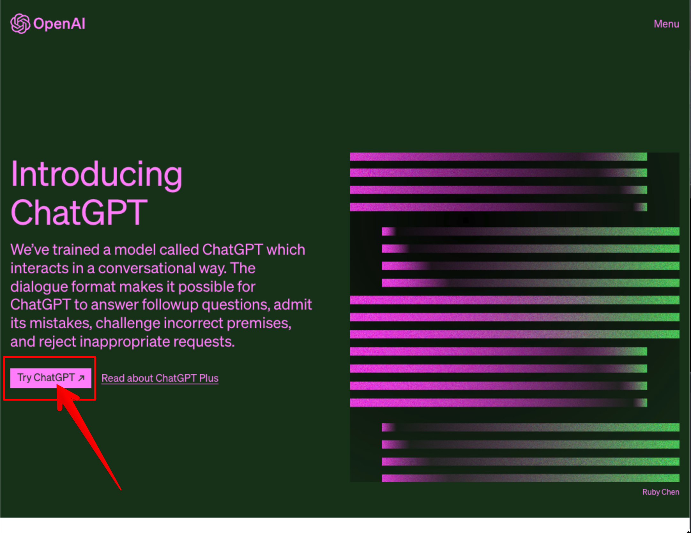

 

### 2. Sign upボタンをクリックします。

以下のページが開きますので、「Sign up」ボタンをクリックします。

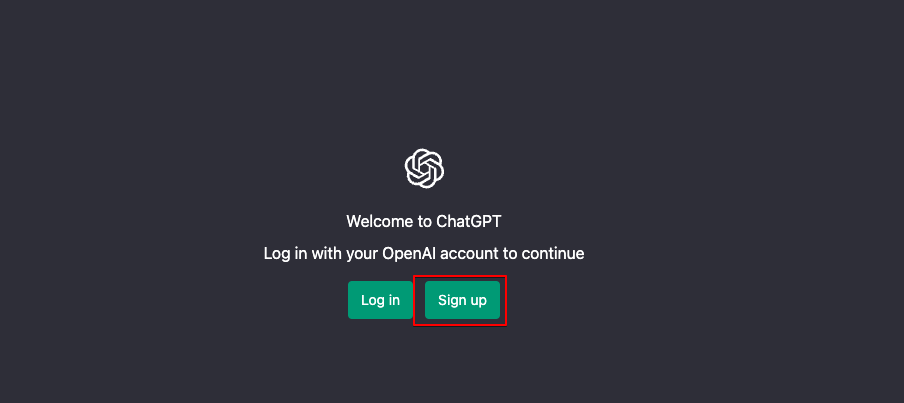

 

### 3. アカウント作成方法を選択する。

アカウントの作成は、E-mail、Googleアカウント、Microsoftアカウントで作成できます。今回はGmailを持っていますのでGoogleアカウントで作成します。

「Continue with Google」ボタンをクリックします。

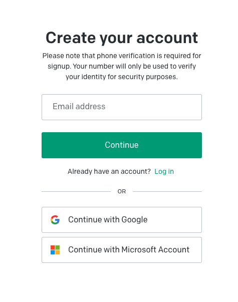

 

#### 4. Google認証を行います。

Googleアカウントが表示されますので、使用するGoogleアカウントを選択します。

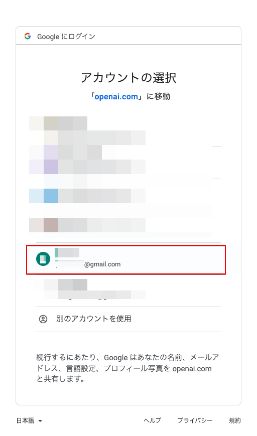

 

### 5. 氏名の入力

氏名の入力が求められます。Googleアカウントに氏名を登録してありますので、今回は自動で入っています。

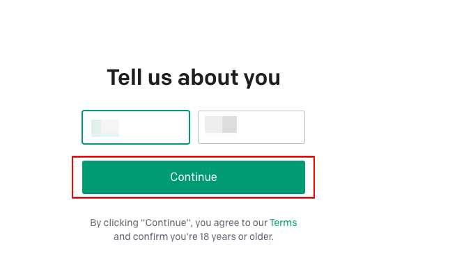

 

### 6. SMS認証

Googleアカウントが2段階認証のため、SMSでのメッセージ送信先電話番号を求められます。

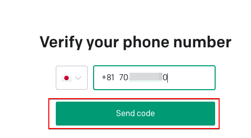

 

### 7. コードの入力

SMSで送信されてきたコードを入力します。

### 8. アカウント作成完了

認証が通り、アカウント作成が完了しました。最初の画面は、無料で使えますが、注意と同意とが表示されます。

- 安全性を向上させるために外部からのフィードバックを求める。
- 間違った情報、誤解させる情報、攻撃的、偏向的なコンテンツを作成する場合があるが、本システムはアドバイスを提供するものではない。

 

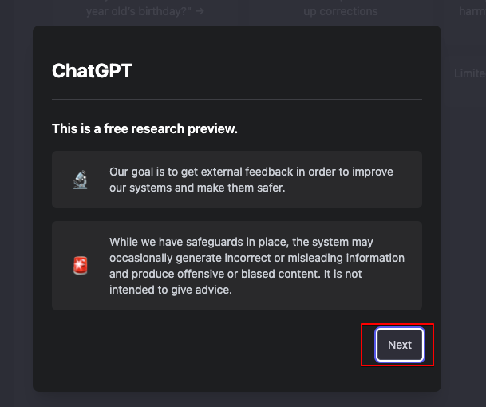

 

- 会話は当社のAIトレイナーもシステム向上、安全性のためレビューします。
- 会話中のヤバい情報はシェアしないでね。

 

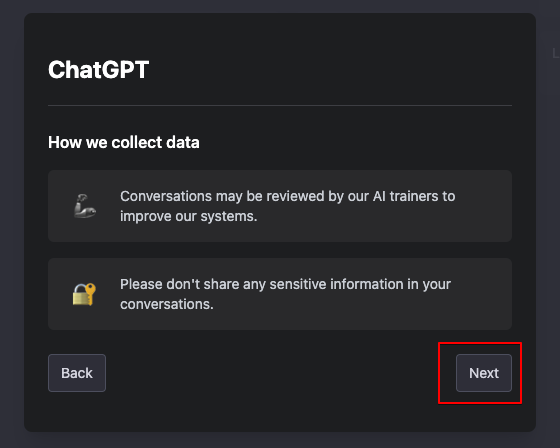

 

- 会話に最適化したシステムです。特定の反応が良かったり、役に立たない場合は教えてね。
- Discord serverでフィードバック待ってます。

 

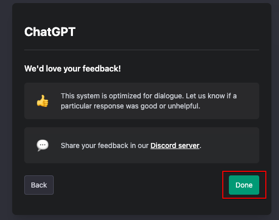

 

### 9. ChatGPT 画面の表示と ChatGPT Plus へアップグレード

Chatのできる画面になります。

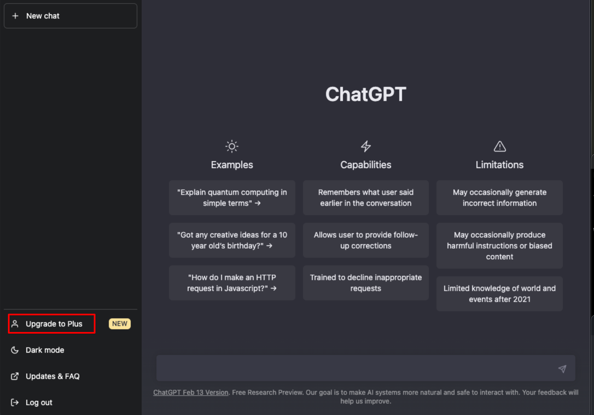

ChatGPTは無料ですとピーク時には繋がりません。また、APIで外部アプリケーションからの質問には無料ですと数文字しか回答がありません。
そのため、月額20ドルのChatGPT Plusに加入します。

 

ChatGPT Plusの特徴は以下となります。

- いつでも止められる。
- いつでも再開できる。
- ModelのDavinciが使える。
- ピークタイムでも繋がる。

 

左下の「Upgrade to Plus」をクリックすると、プラン選択画面が表示されます。月額20ドルの「Upgrade plan」をクリックします。

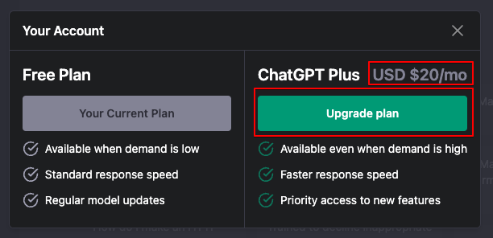

 

支払い方法の入力画面が開きますので、クレジットカード情報を入力し、「申し込む」ボタンをクリックします。

 

### 10. API Keyの取得

最後にAPI Keyを取得します。

[https://openai.com/](https://openai.com/)へアクセスし、右上にあるメニューをクリックします。表示されたメニューから「Log in」をクリックします。

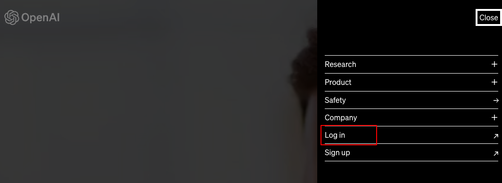

アカウント作製時に使用した方法で、ログインします。

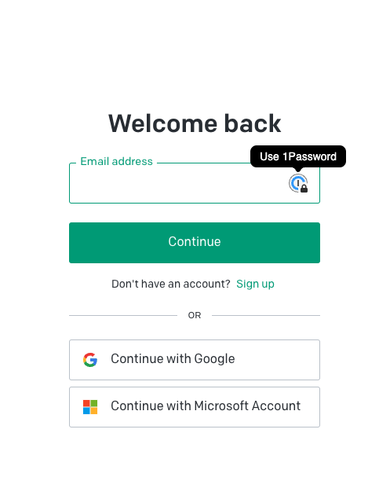

ログインすると、自分のダッシュボードページが開きます。右上のパーソナルをクリックします。

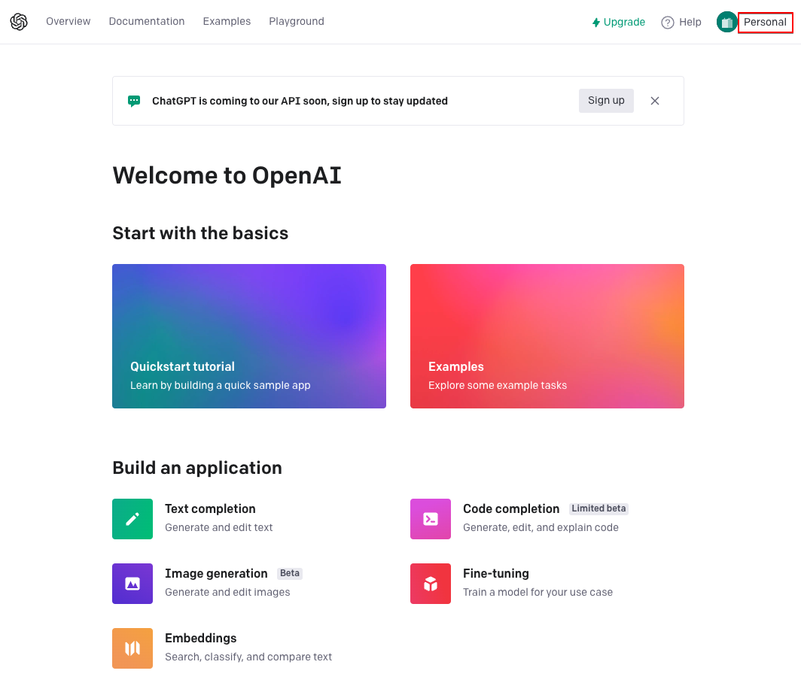

開いたメニューから、「View API keys」をクリックします。

API keysのページが開きます。「+ Create new secret key」ボタンをクリックします。

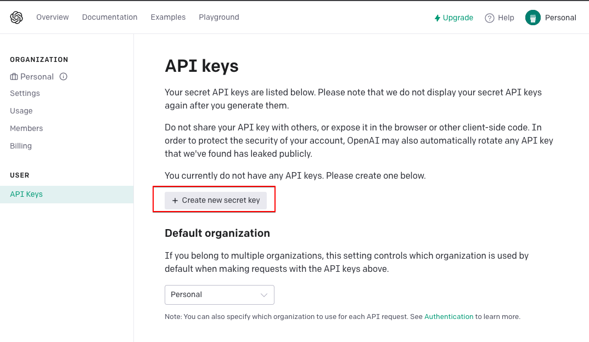

API keyが作成され表示します。右側のコピーボタンをクリックするとキーをコピーできます。「OK」ボタンをクリックして閉じてしまうと、このキーを再度見ることはできません。

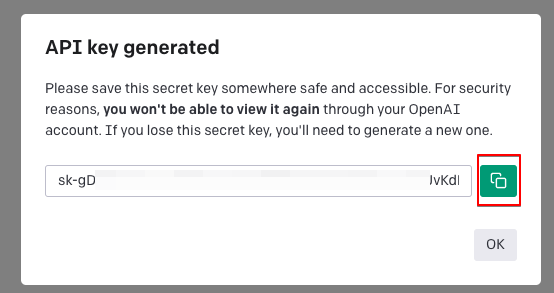

コピーを消した場合などは、再作成し悪用されないためにも削除ボタンで使えないキーは削除しましょう。

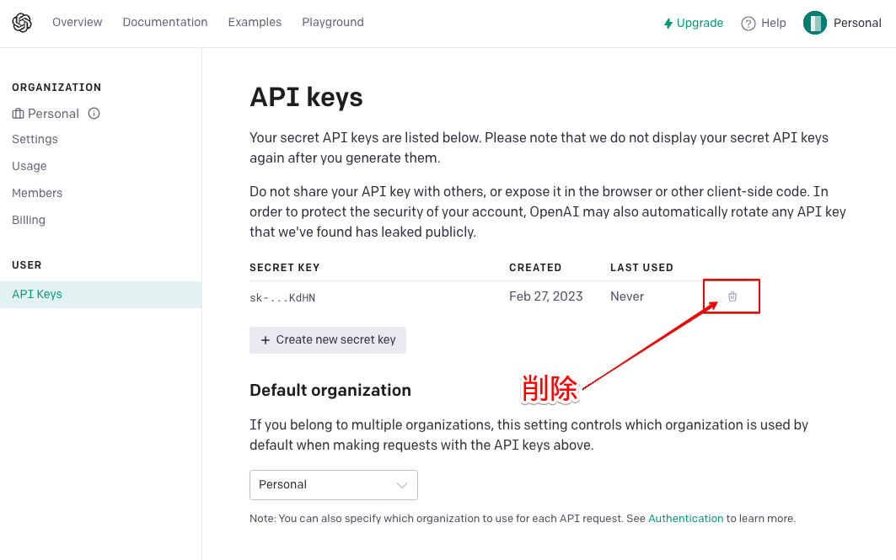
