# WordPress側の準備

WordPress側の準備は、以下の2つです。

1. アプリケーションと安全に通信するための認証の設定
2. 会話調の吹き出し表示のためのプラグインのインストールと設定

## アプリケーションと通信のための設定

WordPressのタイトル、記事（記事、記事タイトル、カテゴリ、タグ）は公開されているので誰でも
読むことができますが、記事の投稿、画像のアップロードは認証を受けたユーザー以外はできないよう制限をかけます。

制限は、プラグインのインストールとWordPressの設定ファイルに2行を追加するだけです。

### JWT Authentication for REST APIプラグイン

認証には、JWT Authentication for REST APIプラグインを使用します。

#### インストール

##### 1. WordPress管理画面にてプラグインの新規インストール

WordPressの管理画面にログインし、左サイドメニューから「プラグイン」->「新規追加」を選択します。
検索窓に「JWT Authentication」と入力し、検索します。

以下のアイコンのプラグインが表示されますので、プラグイン名を確認し「今すぐインストール」をクリックします。

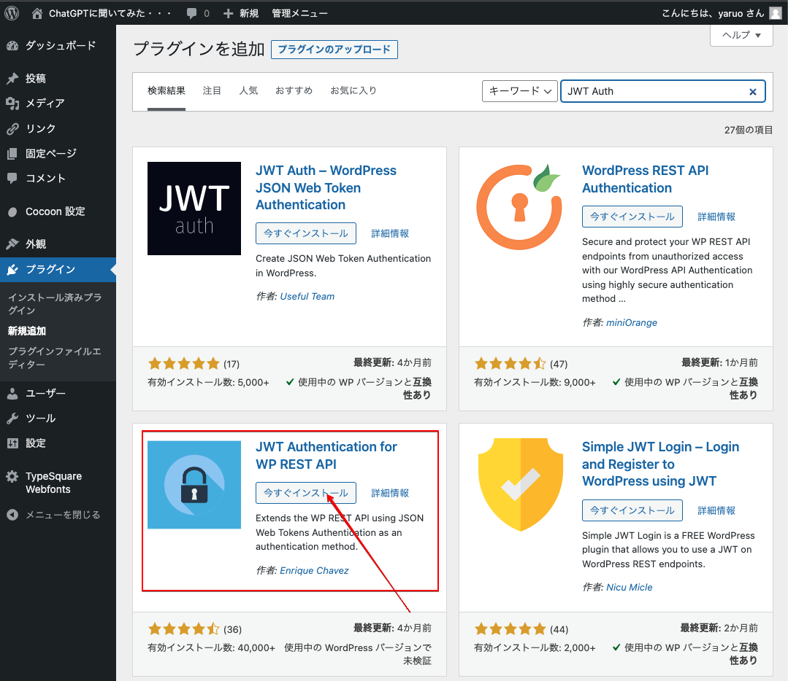

インストールが完了しましたら、「有効化」ボタンをクリックします。

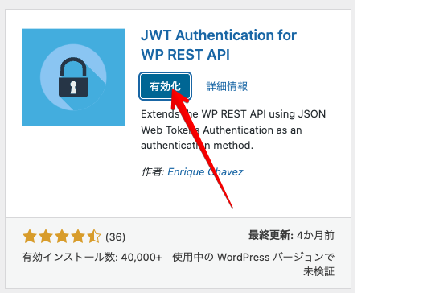

インストール済みプラグイン一覧に、「JWT Authentication for WP-API」がインストール・有効化されています。

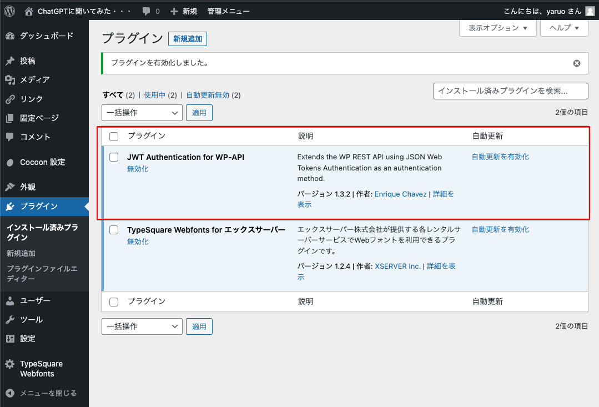

このプラグインの詳細ページに設定方法があります。行うのは以下の2行をWordPressの設定ファイルに追加するだけす。
以下はXSererでの設定方法になります。

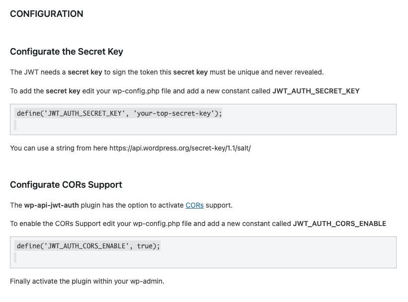

サーバー会社により設定ファイルへのアクセス方法、編集方法が違います。
良く分からない場合には、サーバー会社のサポートへお問い合わせください。

当社でも有料で設定代行を行います。

サーバーのファイルマネージャーにアクセスし、

&nbsp;&nbsp;&#128193;ドメインフォルダー<br />
&nbsp;&nbsp;&nbsp;&nbsp;&nbsp;&nbsp;&#128193;サブドメインフォルダー（WordPressインストールフォルダー）<br />
&nbsp;&nbsp;&nbsp;&nbsp;&nbsp;&nbsp;&nbsp;&nbsp;&nbsp;&nbsp;&#128196;wp-config.php<br />

<br />

を選択し、上部メニューにある「編集」をクリックします。

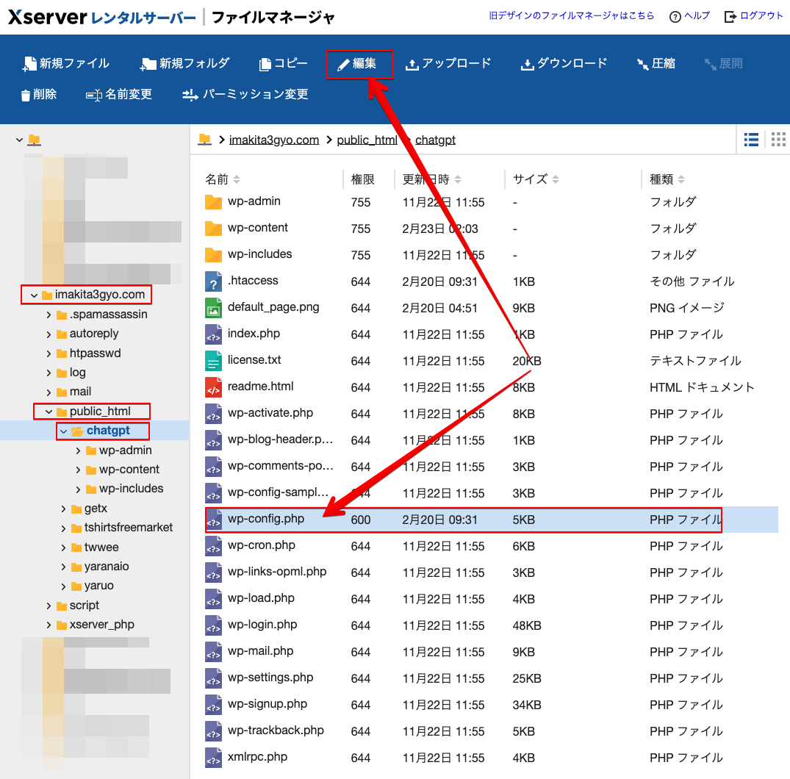

編集画面がポップアップしますので、以下の行を探します。

/\* カスタム値は、この行と「編集が必要なのはここまでです」

行が見つかりましたら、その下に

```php
difine('JWT_AUTH_SECRET_KEY','あなたが決める文字列ｰ何でも良いですが必ず変更してください。');
define('JWT_AUTH_CORS_ENABLE', true);
```

を追加します。編集が完了しましたら「保存文字コード」を「UTF-8」を選択し「更新」ボタンをクリックします。


以上で認証関連の設定は完了です。

## 吹き出し表示用プラグイン

以下のように会話調の吹き出しが表示されるようにプラグインをインストールし設定します。<span style="color:red"><strong>吹き出し表示が不要な方は設定の必要はありません。</strong></span>

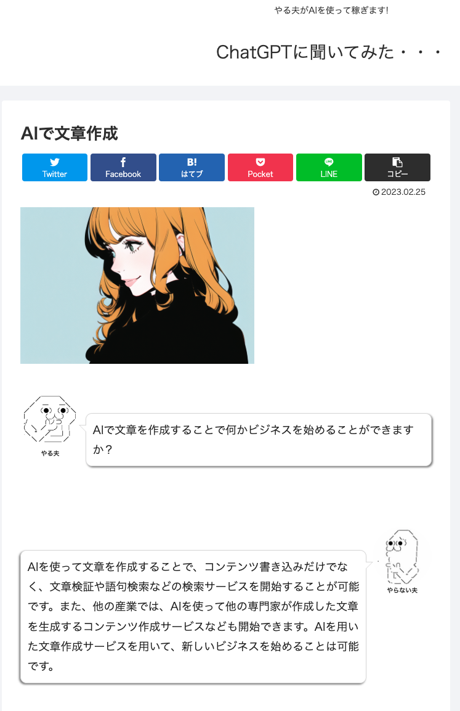

### Word Balloonのインストール

吹き出し表示用のプラグインは、「Word Balloon」を使用します。開発者が日本人ですので説明をすべて日本語で読めますし、有効インストール数も10,000越えのプラグインです。

WordPress管理画面の左サイドメニューから「プラグイン」->「新規追加」を選択し検索窓に「word balloon」と入力し検索します。

以下のアイコンを見つけ、プラグイン名を確認して「今すぐインストール」をクリックします。

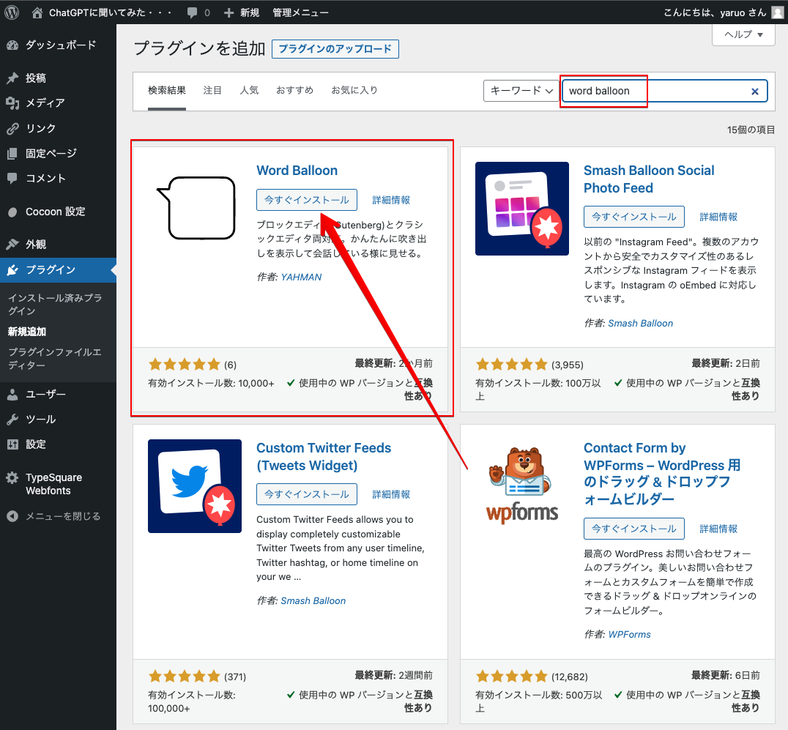

インストールが完了しましたら、「有効化」ボタンをクリックします。

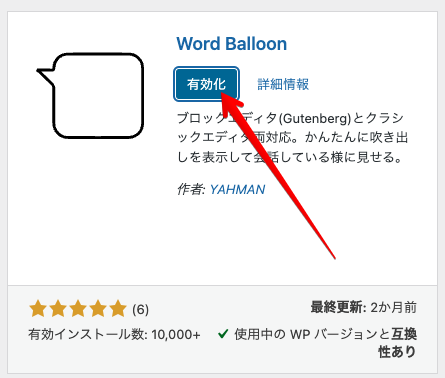

インストール済みプラグイン一覧画面が表示されますので、Word Balloonの「設定」リンクをクリックします。

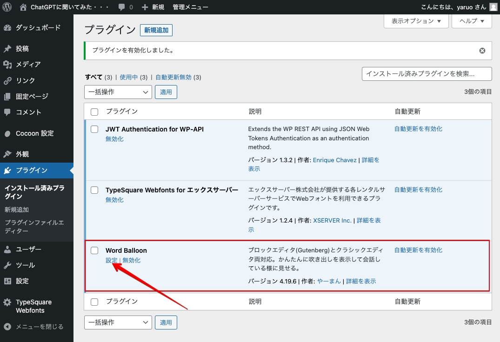

<br />

Word Balloon設定画面が表示されましたら、「アバター」タブを選択し、アバターを2つ作成します。
AIWriterは、アバターIDが「1」、「2」を使います。

アバター用の適当な画像がない方は、「AI Avatar」で検索するとAIでアバター作成するサービスを提供しているサイトが見つかります。

画像をアップロードし、名前を入力して「アバター登録」ボタンをクリックします。

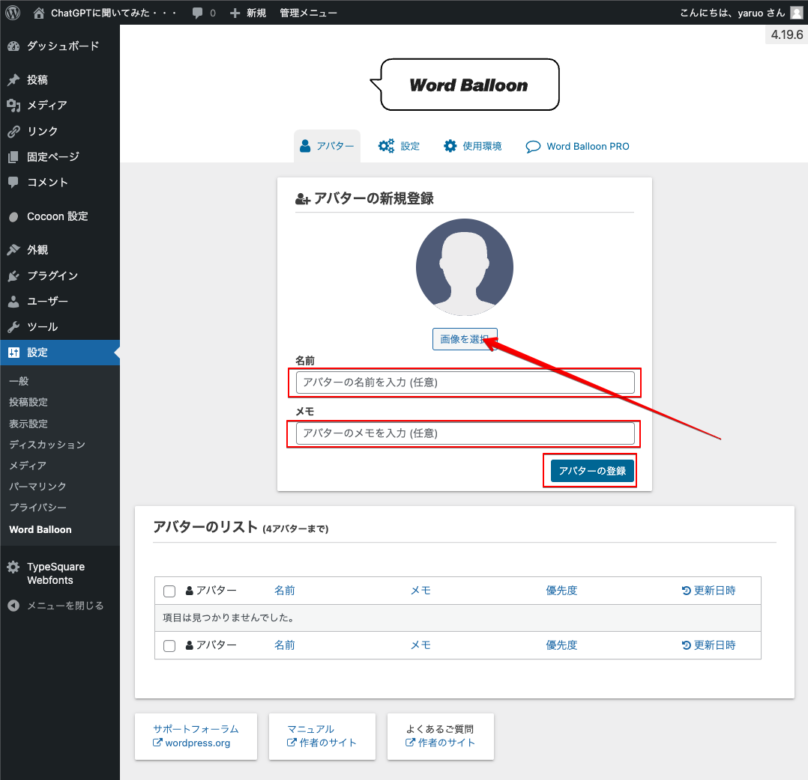
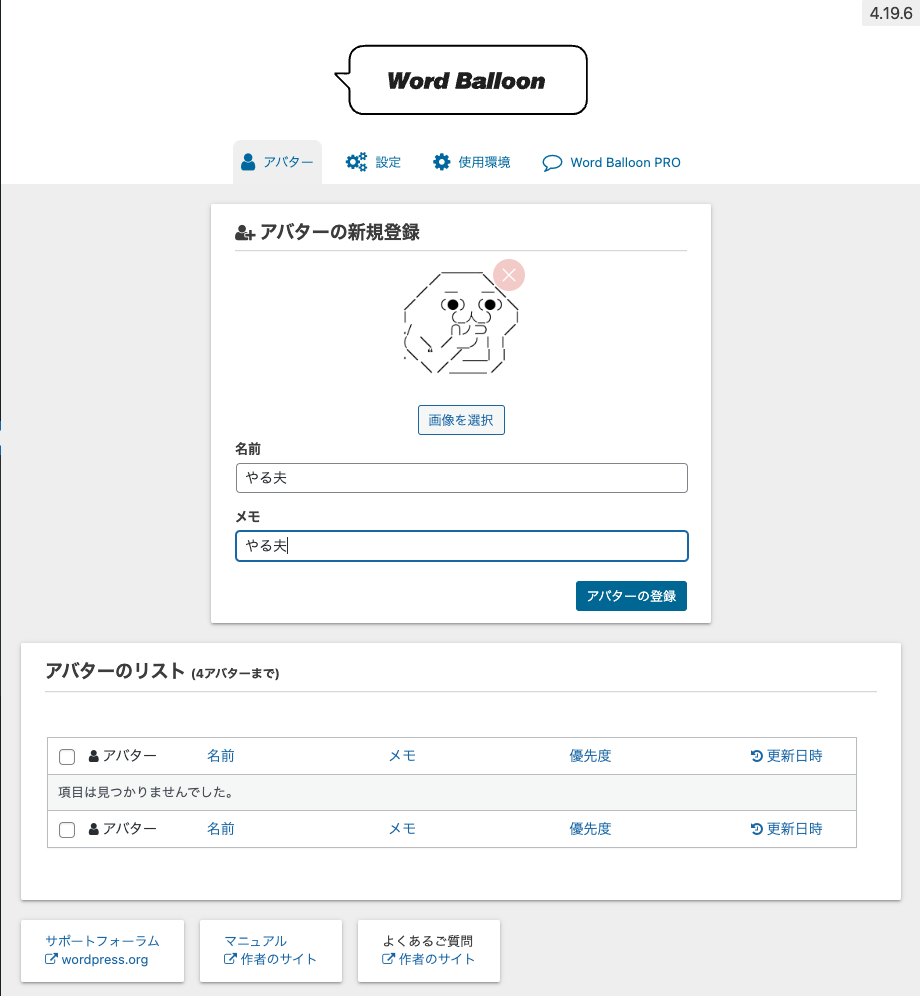
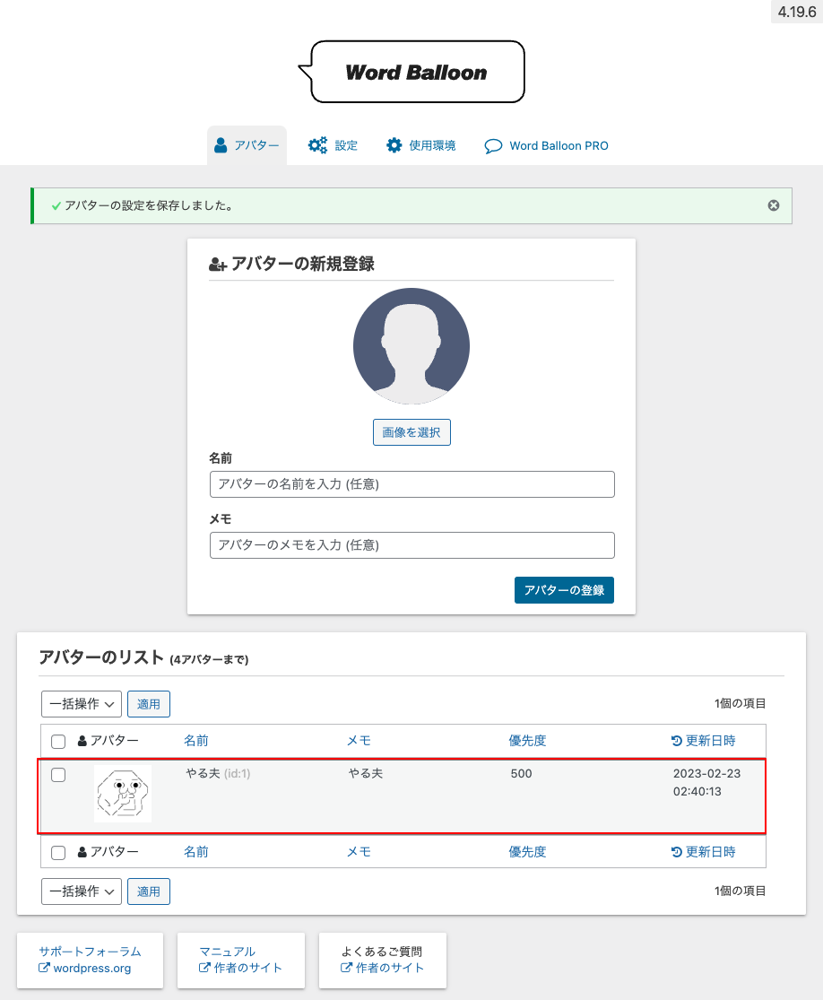


以上で、吹き出し表示用プラグインの設定が完了しました。
