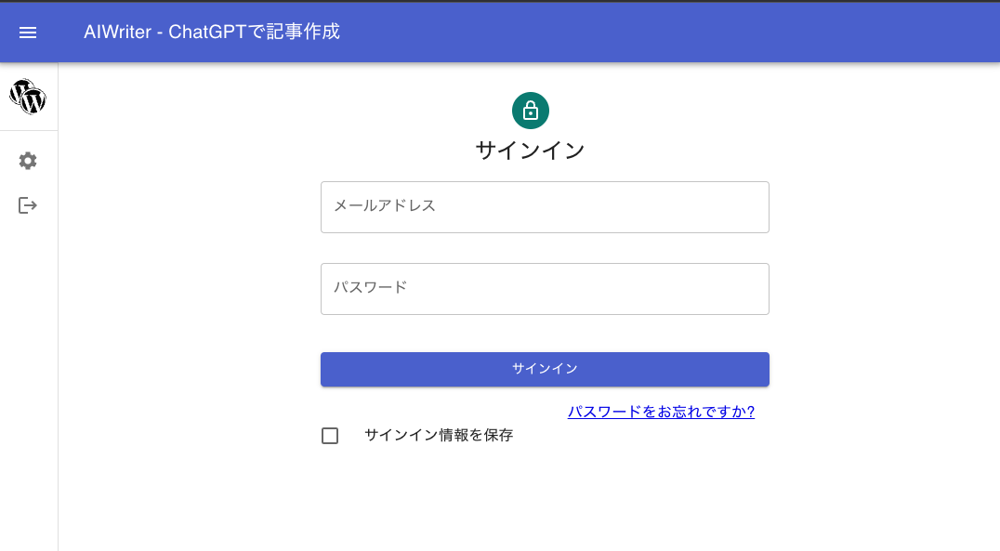
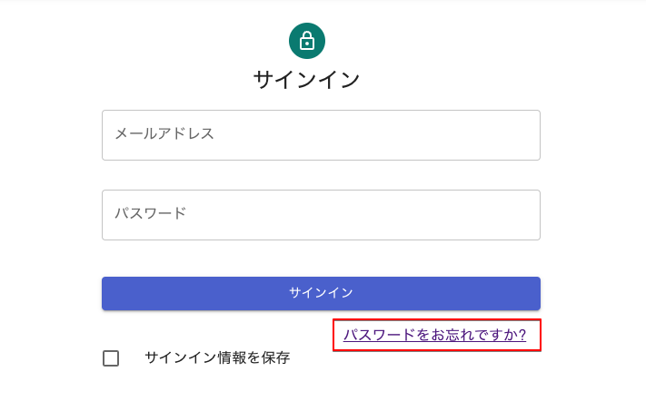
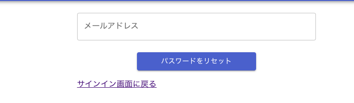

# サインイン

AIWiterは、Webアプリケーションです。登録するChatGPT API KeyやWordPressのログイン情報は
Googleのサーバー上に厳重に保管されています。

サインインで認証されたユーザーが自分のデータにのみアクセスできるように構成されています。
データの取得、保存のためにサインインが必要となります。

## メールアドレスとパスワード

購入完了のメールがこちらに届き次第、アカウントを作成し、サインインのためのメールアドレス、パスワードを購入後24時間以内にお知らせします。
初回サインインのためのメールアドレスは購入時に使用されたメールアドレス、パスワードはこちらで決めたものとなります。

もし、購入後24時間経過してもパスワードが届かない場合には、大変お手数ですが、

- 送信先: support@imakita3gyo.com
- 件名: パスワードが届きません。
- 本文: 購入時のメールアドレス、支払い方法

をお知らせください。

## パスワードの変更

パスワードが届きましたら、アカウント作成が完了しています。サインイン画面から「パスワードをお忘れですか？」のリンクを使い、
パスワードをリセットしてください。

変更されたパスワードは、管理者側からも見ることはできません。

