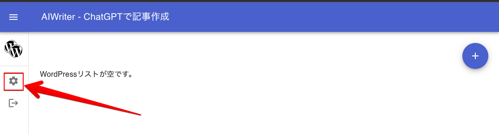
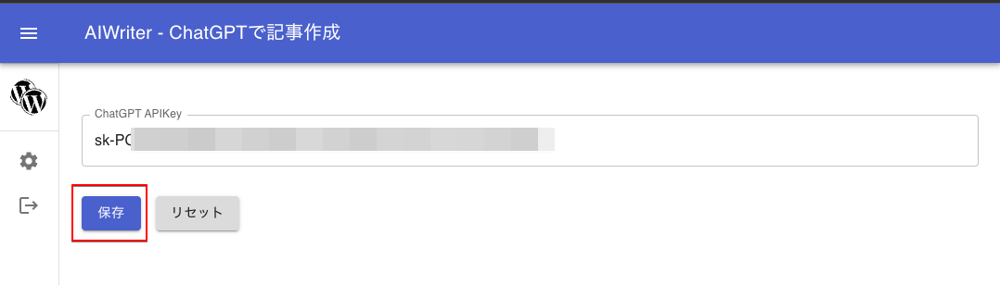
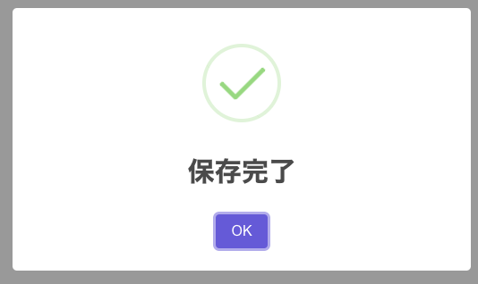

# 設定

アプリケーションでChatGPTと会話するためには、準備で取得していただいたAPI Keyが必要です。

## 1. 設定ボタンをクリック

左側メニューにあります「設定」アイコンをクリックします。

## 2. ChatGPT API Keyを入力

準備編で取得したChatGPT API Keyを入力し、「保存」ボタンをクリックします。

## 3. 保存完了ダイアログ

保存されましたら、完了ダイアログが表示されます。Googleのサーバー上に保存されていますので
他のデバイス（スマホなど）からサインインしてもすでに保存しているキーを自動で取得します。

