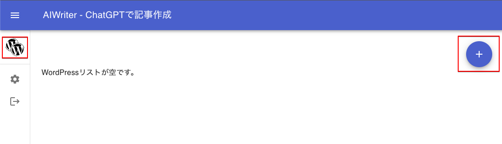
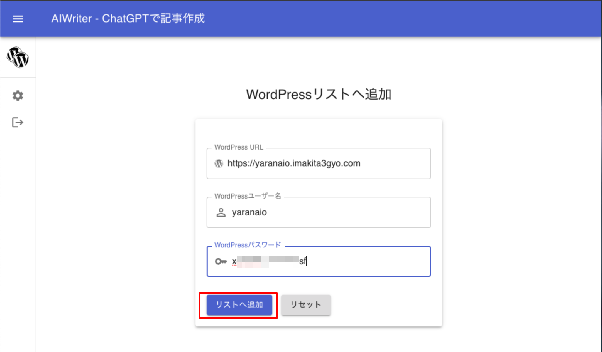
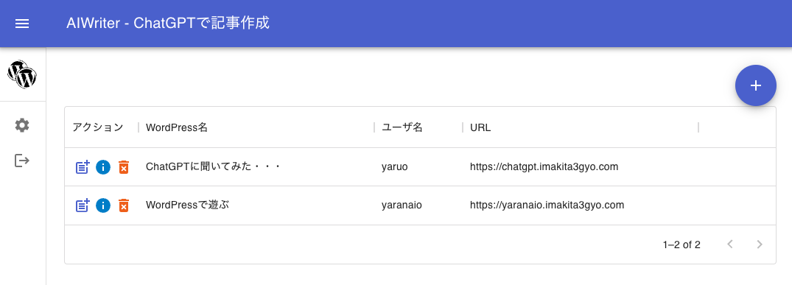

# 投稿先WordPressの登録

投稿先のWordPressの登録を行います。必要な情報は、2つです。

- 登録先WordPressのURL（インストール先URL）認証を行いますのでhttpsが必須です。
- WordPressログイン用のユーザー名、パスワード

## 1. 左メニューの「WordPressのリスト」をクリックします。

左サイドメニューにあるWordPressのアイコンをクリックします。登録しているWordPressがリスト表示されます。
登録されているWordPressがない場合には、以下のような表示になります。

左上部にある「+」ボタンをクリックして新規登録画面に切り替えます。

## 2. WordPressの登録

新規WrodPressの登録画面が表示しましたら、登録に必要な情報を入力します。

- URL:　必ず、https:// から入力してください。通信時にユーザー名、パスワードを暗号化するためにhttpsは必須です。
- WordPressのログイン情報（ユーザー名、パスワード）

ここで使用するユーザ名の権限内でしか使えません。たとえば、閲覧専用ユーザーの場合は、投稿できません。

情報を入力し、「リストへ追加」ボタンをクリックすると

- WordPressと通信し、ユーザー情報でログイン。
- 準備でインストールした認証用プラグインからトークンを取得
- WordPressのタイトルを取得

を行い、Googleサーバー上のあなたのアカウントへ保存します。

## 3. WordPressリストへ追加完了

エラーなしで通信が完了しましたら、以下のようにリストに追加されます。

左側のアイコンが

- 記事追加
- WordPressの情報表示
- リストから削除

の機能をもっています。

