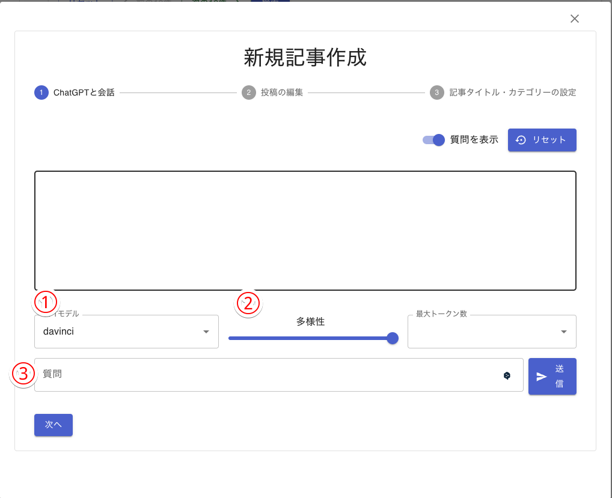
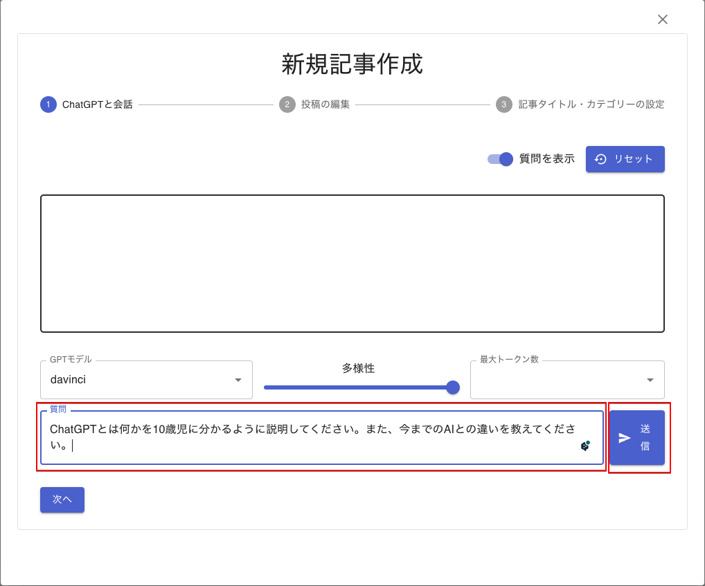
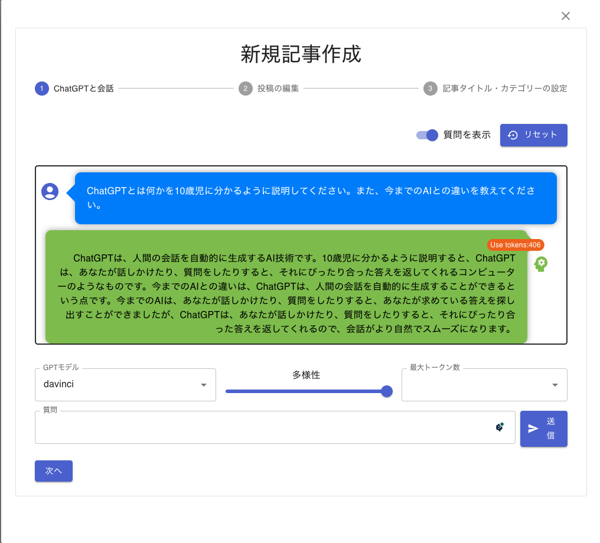
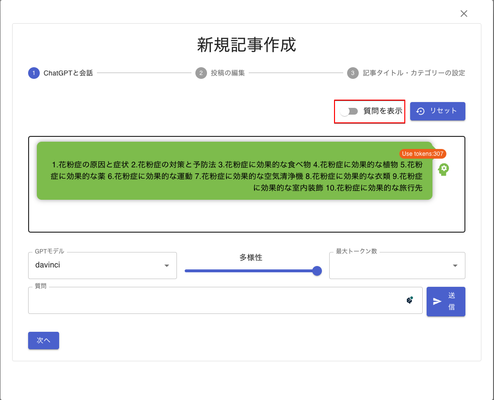
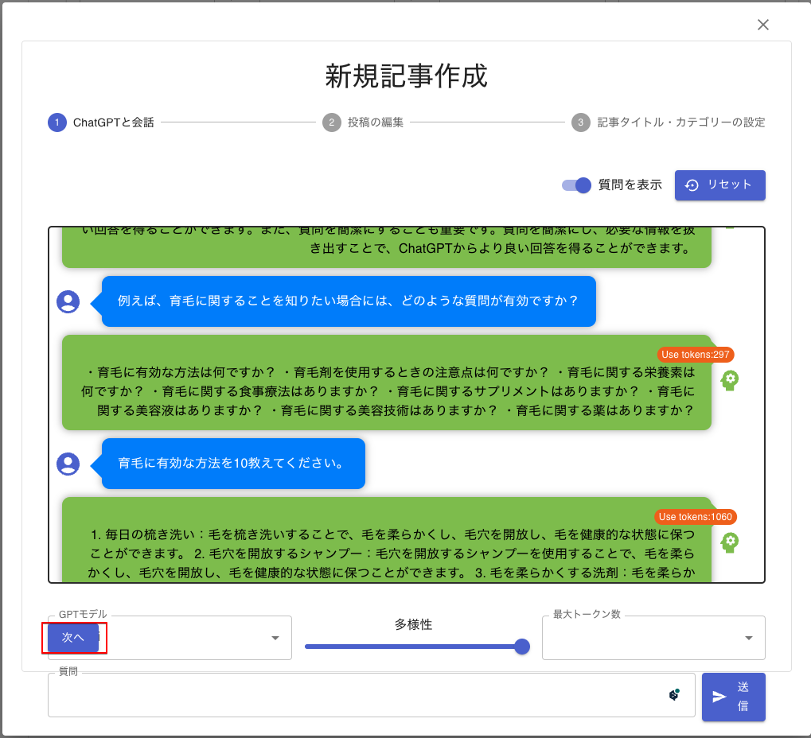

# ChatGPTと会話する

新規記事作成画面が開き、ChatGPTとの会話ができる画面になります。

## 1. モデルの選択

ChatGPTには、4つのモデルがあります。以下は、ChatGPTへの質問と回答です。AIWriterでは、定額のGPT Plusアカウントを使うため、デフォルトで「davinci」を選択しています。

#### Q.　質問

ChatGPTのモデル　davinci、curie、babbage、adaの違いを教えてください。

#### A.　回答

ChatGPTにはいくつかのモデルがあり、その中には以下のようなものがあります。

1.  Davinci: Davinciは、GPT-3のもっとも高度なモデルであり、175Bのパラメーターを持つ巨大なニューラルネットワークです。Davinciは、自然な言語処理タスクにおいて非常に高い性能を発揮します。Davinciは、広範な知識を持ち、文脈に応じた適切な回答を生成できます。
2.  Curie: Curieは、Davinciよりも小さなモデルであり、15Bのパラメーターを持つニューラルネットワークです。Curieは、Davinciと同じく、高度な自然言語処理タスクに適していますが、より小規模な問題に特化しています。
3.  Babbage: Babbageは、6.7Bのパラメーターを持つ比較的小さなモデルです。Babbageは、より簡単な自然言語処理タスクに適しています。
4.  Ada: Adaは、1.2Bのパラメーターを持つChatGPTのもっともも小さなモデルの1つです。Adaは、短いテキストに対する回答を生成することに適しています。

これらのモデルは、それぞれ異なるパラメーター数と性能を持ち、適したタスクによって使い分けられます。たとえば、大量のテキストデータを扱うような大規模な自然言語処理タスクにはDavinciが適している一方、より小規模なタスクにはBabbageやAdaが適していると言えます。

#### Q. 質問

davinciはChat GPT Plusのみ使えるのですか？

#### A. 回答

はい、現在、DavinciモデルはOpenAIのサービスである「Chat GPT-3」の中でのみ利用可能です。このサービスは、APIを通じて企業や開発者に提供されています。ただし、Davinciモデルは、Chat GPT-3 Plusプランにのみ含まれており、より高度な自然言語処理タスクに適しています。Chat GPT-3 Plusプランには、Davinciモデルの他にも、より小規模なモデルであるCurie、Babbage、Adaが含まれています。

## 2. 多様性

ChatGPTでは、「Temperature」と呼ばれています。直訳すると「温度」なのですが、「多様性」と訳しています。

以下は、ChatGPTの回答です。AIWriterでは、最小:0　最大:2となり、中間は自由にスライダーで設定できます。

#### Q. 質問

Chat GPT APIの多様性の使い方を教えてください。0の場合、1の場合、2の場合で回答に違いがでますか？

#### A. 回答

Chat GPT APIの多様性パラメーターは、AIモデルがどれだけオリジナリティを持って回答を生成するかを決定するパラメーターです。 0の場合：AIモデルは、入力されたテキストに基づいて、より安全な回答を生成します。 1の場合：AIモデルは、入力されたテキストに基づいて、よりオリジナリティのある回答を生成します。 2の場合：AIモデルは、入力されたテキストに基づいて、より非常にオリジナリティのある回答を生成します。

## 最大トークン数

ChatGPTでは、質問＋回答を単語に分け、1単語1トークンで計算し、トータルのトークン数に1000トークン毎課金します。料金は使用するモデルで異なりますが、davinciが$0.0004です。GPT Plusは定額ですので、AIWriterは最大の4096トークンで質問します。

## 3. 質問

ChatGPTへの質問を入力します。

送信ボタンをクリックすると、回答があり以下のように表示されます。

ChatGPTからの回答だけを記事に使い対場合には、「質問を非表示」にすれば、回答のみ表示します。

## 次へ

質問の回数に制限はありませんが、それだけ記事が長くなります。ChatGPTとの会話が終了すれば、「次へ」ボタンをクリックします。

