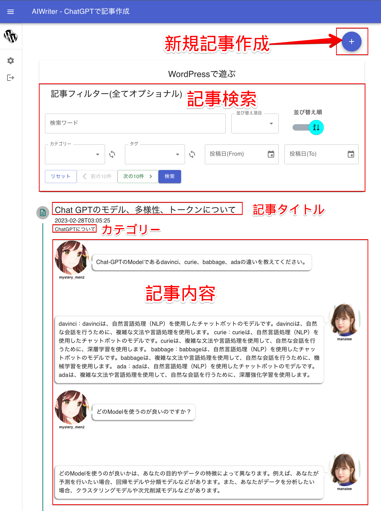

# 新規記事の作成と投稿

記事を作成し投稿するのは、ステップ方式になります。

1.  ChatGPTと会話する。（スキップも可能）
2.  HTMLを編集する。
3.  記事タイトル、カテゴリー、タグを入力
4.  投稿

## 記事作成ボタンで開始

WordPressリストの左アイコンをクリックすると、選択したWordPressの画面になります。

現時点での記事が最新より10件表示されます。右上の「+」ボタンをクリックすると新規記事作成ウィンドウが開きます。

