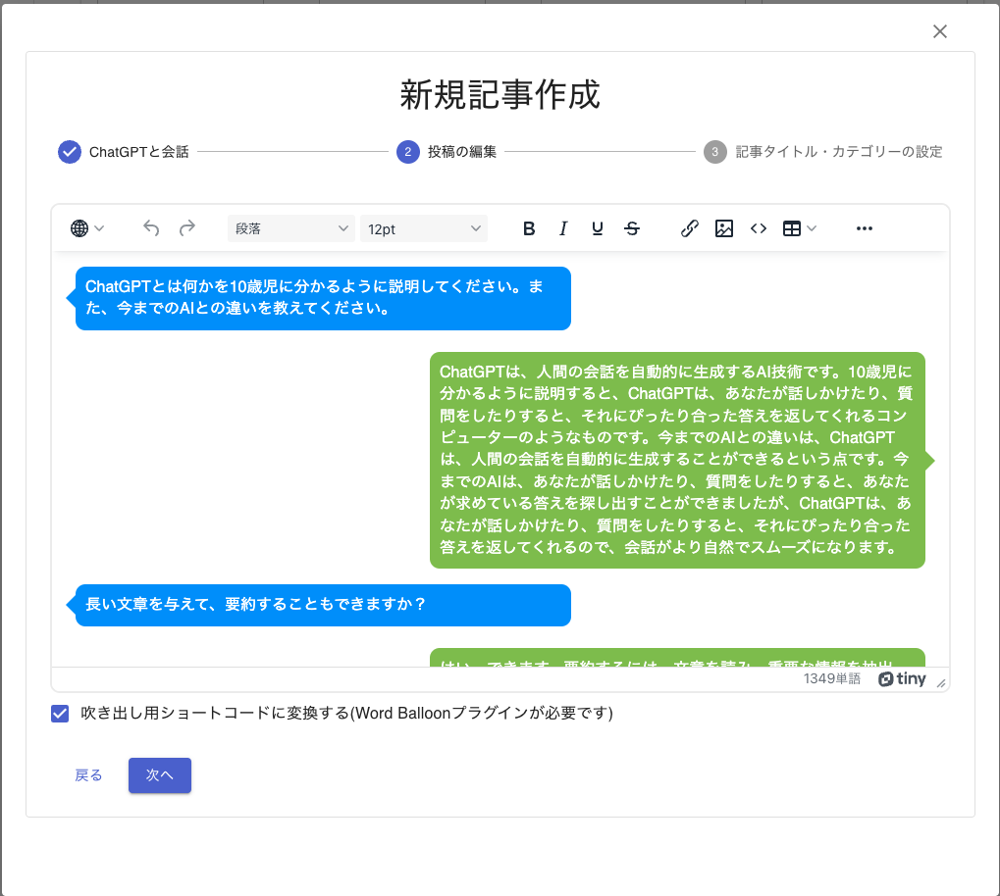
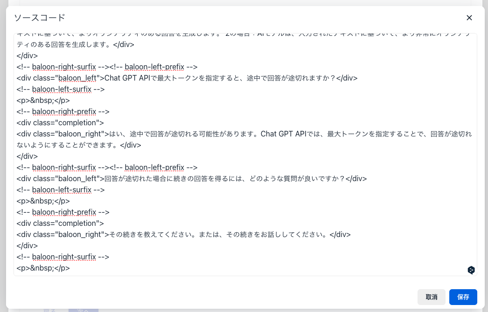
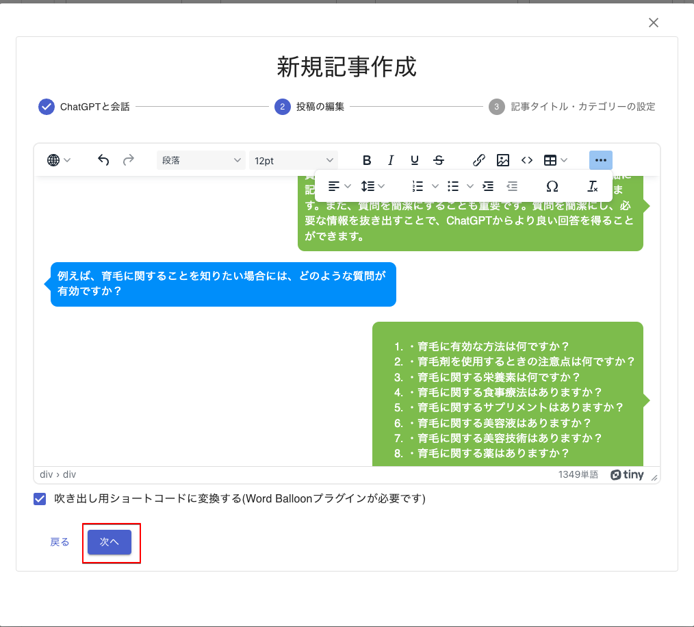

# 編集

ChatGPTとの会話がHTMLに変換し、HTML編集画面が開きます。

## HTMLエディター

WordPressでグーテンベルク採用前までに使われていたHTMLエディターと同じように、
HTMLを編集できます。

- 見出し（h1〜h5タグ）
- フォントの大きさ
- 太字・斜体・アンダーライン・打ち消し線
- リンク
- 画像の挿入 (WordPressへのアップロードも行います。)
- テーブルの挿入
- 右寄せ・中央寄せ・左寄せ

など、たいていのことはできます。

### 吹き出し用ショートコード

準備編でインストールした「Word Balloon」用のショートコードを自動生成します。チェックを付けない場合には、段落（pタグ）に変換されます。

### HTMLソースコード

ツールボタンの</>をクリックするとHTMLソースコードを表示しますが、編集はできません。

## 編集完了

編集が完了しましたら、「次へ」ボタンをクリックします。記事タイトルなどの設定画面に変わります。

