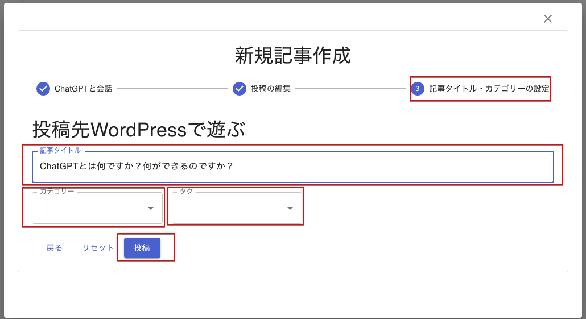
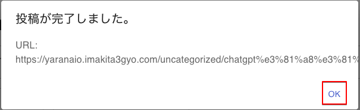

# 投稿

記事のタイトルを入力し、投稿先カテゴリー・タグを選択します。カテゴリー・タグの追加はWordPressの管理画面でおこないます。

カテゴリーが未入力の場合には、デフォルトのカテゴリーへ投稿されます。

入力が完了しましたら、「投稿」ボタンをクリックします。

WordPressへ投稿が行われ、記事ページのURLが表示されます。

「OK」をクリックすると完了画面に切り替わります。
